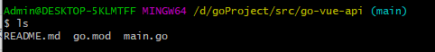
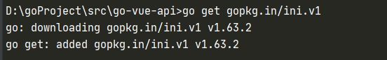

# go-vue-api

# 项目初始化

在项目文件目录中生成go.mod文件

```
go mod init go-vue-api
```



安装Gin

```
go get -u github.com/gin-gonic/gin
```

-u标识安装最新版本


安装配置仓库

```
go get gopkg.in/ini.v1
```



安装日志仓库

```
go get -u github.com/sirupsen/logrus
```

